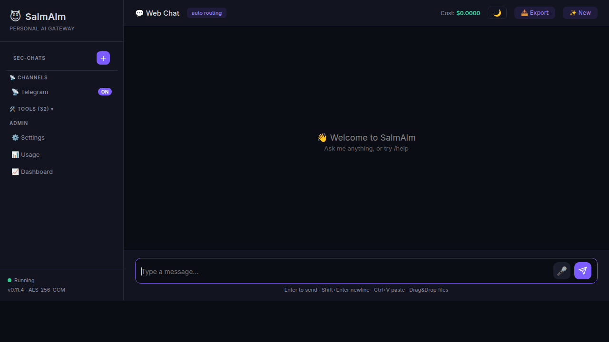

# SalmAlm 🤖

[](https://pypi.org/project/salmalm/)
[](https://pypi.org/project/salmalm/)
[](LICENSE)
[](https://github.com/hyunjun6928-netizen/salmalm/actions/workflows/test.yml)

> **Personal AI Gateway — Pure Python, zero required dependencies.**
> **개인 AI 게이트웨이 — 순수 Python, 필수 의존성 제로.**



---

## Quick Start / 빠른 시작

```bash
pip install salmalm
salmalm start
# Open http://localhost:8080
```

That's it. No Docker, no Node.js, no config files needed for first run.
설치 후 바로 실행. Docker도, Node.js도, 설정 파일도 필요 없습니다.


---

## Features / 주요 기능

- 🧠 **Multi-LLM support** (Anthropic, OpenAI, Google, xAI, DeepSeek, Meta, Ollama — 27+ models) / **멀티 LLM 지원** (27개 이상 모델)
- 🔧 **43 built-in tools** (exec, web, files, browser, Gmail, Calendar, RAG, MCP, and more) / **43개 내장 도구**
- 🌐 **Web UI dashboard** with dark/light theme, markdown rendering, SSE streaming / **웹 UI 대시보드** (다크/라이트 테마, 마크다운, SSE 스트리밍)
- 💬 **Telegram & Discord bot** / **텔레그램 & 디스코드 봇**
- 🧩 **Memory system** with session persistence / **메모리 시스템** (세션 영속성)
- 📜 **Skill system** with YAML frontmatter / **스킬 시스템** (YAML 프론트매터)
- 💰 **Cost cap safety** ($50 default, per-model token tracking) / **비용 상한 안전장치** (기본 $50, 모델별 토큰 추적)
- 📦 **Zero dependencies** beyond stdlib (`cryptography` optional for AES-256-GCM) / **stdlib 외 의존성 없음** (`cryptography`는 선택)
- 🔍 **RAG search** (BM25-based, SQLite persistence, bigram support) / **RAG 검색** (BM25 기반, SQLite 영속화)
- 🔌 **MCP protocol** server + client (Cursor / VS Code integration) / **MCP 프로토콜** 서버 + 클라이언트
- 🌍 **Gateway-Node** multi-machine tool dispatch / **게이트웨이-노드** 멀티머신 도구 디스패치
- 🏥 **Circuit breaker** + health checks + auto-recovery / **서킷 브레이커** + 헬스체크 + 자동 복구
- ⏰ **Cron scheduler** (LLM-powered scheduled tasks) / **크론 스케줄러** (LLM 기반 예약 작업)
- 🔐 **Security** — AES-256-GCM vault, JWT auth, RBAC, rate limiting / **보안** — 암호화 볼트, JWT 인증, RBAC, 레이트 리밋

---

## Setup Guide / 설정 가이드

### 1. Install / 설치

```bash
# From PyPI (recommended)
pip install salmalm

# With encryption support / 암호화 지원 포함
pip install salmalm[crypto]

# From source / 소스에서 설치
git clone https://github.com/hyunjun6928-netizen/salmalm.git
cd salmalm
pip install -e .
```

**Requirements / 요구사항:** Python 3.10+

### 2. First Run / 첫 실행

```bash
salmalm start
```

The setup wizard will guide you through initial configuration on first run.
첫 실행 시 설정 마법사가 초기 구성을 안내합니다.

Open **http://localhost:8080** in your browser.
브라우저에서 **http://localhost:8080**을 엽니다.


### 3. API Key Setup / API 키 설정

Set your LLM provider API keys via the vault:
볼트를 통해 LLM 제공자 API 키를 설정하세요:

```bash
# Via environment variable / 환경 변수로
export ANTHROPIC_API_KEY=sk-ant-...

# Or via .env file / .env 파일로
echo "ANTHROPIC_API_KEY=sk-ant-..." >> .env

# Or via the Web UI Settings page / 웹 UI 설정 페이지에서
# Navigate to Settings → API Keys
```

Supported providers / 지원 제공자: **Anthropic**, **OpenAI**, **Google**, **xAI**, **DeepSeek**, **Ollama** (local)

### 4. Telegram Bot Setup / 텔레그램 봇 설정

1. Open Telegram and search for **@BotFather** / 텔레그램에서 **@BotFather** 검색
2. Send `/newbot` and follow the prompts / `/newbot` 전송 후 안내를 따름
3. Copy the bot token / 봇 토큰 복사
4. Set the token in SalmAlm / SalmAlm에 토큰 설정:

```bash
# Via .env
echo "TELEGRAM_BOT_TOKEN=123456:ABC-..." >> .env

# Or via Web UI → Settings → Telegram
```

5. Start chatting with your bot! / 봇과 대화 시작! 🎉

### 5. Discord Bot Setup / 디스코드 봇 설정

1. Go to [Discord Developer Portal](https://discord.com/developers/applications) / [디스코드 개발자 포털](https://discord.com/developers/applications) 접속
2. Create a new application → Bot → copy token / 새 애플리케이션 생성 → Bot → 토큰 복사
3. Enable **Message Content Intent** / **Message Content Intent** 활성화
4. Invite the bot to your server / 봇을 서버에 초대
5. Set the token / 토큰 설정:

```bash
echo "DISCORD_BOT_TOKEN=MTIz..." >> .env
```

---

## Configuration / 설정

### Environment Variables / 환경 변수

| Variable | Default | Description / 설명 |
|----------|---------|-------------------|
| `SALMALM_COST_CAP` | `50` | Monthly cost limit in USD / 월 비용 상한 (달러) |
| `SALMALM_LLM_TIMEOUT` | `120` | LLM request timeout in seconds / LLM 요청 타임아웃 (초) |
| `SALMALM_HOST` | `0.0.0.0` | Server bind address / 서버 바인드 주소 |
| `SALMALM_PORT` | `8080` | Server port / 서버 포트 |
| `SALMALM_LOG_LEVEL` | `INFO` | Log level / 로그 레벨 |

### Vault / 볼트

API keys are stored in an encrypted vault (AES-256-GCM with `cryptography`, HMAC-CTR fallback without it).
API 키는 암호화된 볼트에 저장됩니다 (AES-256-GCM 또는 HMAC-CTR 폴백).

### Model Aliases / 모델 별칭

Configure short aliases for models in your config:
설정에서 모델 단축 별칭을 구성할 수 있습니다:

```
claude → claude-sonnet-4-20250514
gpt → gpt-4o
gemini → gemini-2.0-flash
```

---

## Architecture / 아키텍처

```
┌─────────────────────────────────────────────┐
│                  SalmAlm                     │
│                                              │
│  ┌──────────┐  ┌──────────┐  ┌───────────┐  │
│  │ Web UI   │  │ Telegram │  │  Discord   │  │
│  └────┬─────┘  └────┬─────┘  └─────┬─────┘  │
│       └──────────────┼──────────────┘        │
│              ┌───────▼────────┐              │
│              │  Intelligence  │              │
│              │    Engine      │              │
│              └───────┬────────┘              │
│       ┌──────────────┼──────────────┐        │
│  ┌────▼────┐  ┌──────▼─────┐  ┌────▼────┐   │
│  │ 43 Tools│  │ LLM Router │  │   RAG   │   │
│  └─────────┘  └──────┬─────┘  └─────────┘   │
│              ┌───────▼────────┐              │
│              │  Multi-Provider│              │
│              │  (27+ models)  │              │
│              └────────────────┘              │
└─────────────────────────────────────────────┘
```

**stdlib-only philosophy / stdlib 전용 철학:**
SalmAlm is built entirely on Python's standard library. No Flask, no FastAPI, no aiohttp — just raw `http.server`, `asyncio`, and hand-rolled WebSocket (RFC 6455). This means zero dependency conflicts, instant installation, and a tiny attack surface. The only optional dependency is `cryptography` for stronger vault encryption.

SalmAlm은 Python 표준 라이브러리만으로 구축되었습니다. Flask도, FastAPI도, aiohttp도 없이 — `http.server`, `asyncio`, 직접 구현한 WebSocket(RFC 6455)만 사용합니다. 의존성 충돌 제로, 즉시 설치, 최소 공격 면적. 유일한 선택적 의존성은 강화된 볼트 암호화를 위한 `cryptography`입니다.

---

## Stats / 통계

- **25 modules** / ~12,000+ lines of Python
- **498 unit tests** / 48% coverage / mypy 0 errors
- **CI:** 12-matrix (Python 3.10–3.13 × Ubuntu / macOS / Windows)

---

## Contributing / 기여

See [CONTRIBUTING.md](CONTRIBUTING.md) for guidelines.
기여 가이드라인은 [CONTRIBUTING.md](CONTRIBUTING.md)를 참조하세요.

## License / 라이선스

[MIT](LICENSE) © hyunjun6928-netizen
